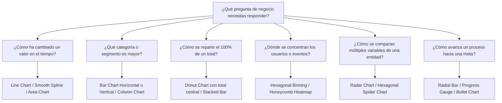

# 📊 Directiva Maestra: Estándares, Anatomía y Selección de Charts para Dashboards
> **Ámbito de aplicación:** Web, Desktop y Mobile Apps (Flutter, React, Vue, Tailwind).  
> **Propósito:** Esta guía define las reglas innegociables de diseño analítico, la anatomía de componentes visuales inspirados en referencias premium y la matriz de decisión sobre qué gráfico utilizar para responder cada pregunta de negocio sin saturar la pantalla.

---

## 🏛️ 1. Las 6 Leyes de Oro del Dashboarding (Anti-Ruido)

Todo dashboard desarrollado bajo este estándar debe cumplir estrictamente estas seis directivas:

| # | Problema Común | Diagnóstico | Solución Innegociable |
|---|---|---|---|
| **1** | **Equipotencia Visual** | Todo compite por atención, nada sobresale. | **Insight Principal (Hero):** La pantalla arranca con una métrica reina que resume el estado global del negocio. Las demás métricas la complementan. |
| **2** | **Contaminación Cromática** | Arcoíris de colores que genera fatiga. | **Regla 60-30-10:** 60% neutral de fondo (`surface`), 30% soporte estructural (`borders`, `text-muted`) y **10% de acento** (`primary`) reservado exclusivamente para llamar la atención sobre puntos críticos. |
| **3** | **Chart Antes de la Pregunta** | Gráficos puestos por relleno estético. | **Primero la pregunta, luego el chart:** Todo gráfico debe responder una inquietud específica de negocio (*"¿Hacia dónde va la tendencia?"*, *"¿Dónde se concentra la venta?"*). |
| **4** | **Números Desnudos (Sin Contexto)** | Un número aislado (`$31K`) no comunica nada. | **Comparativa Forzosa:** Siempre contrastar con: target, mes anterior o periodo previo (`vs last month`). Acompañar el KPI con un micro-gráfico de tendencia (*sparkline*). |
| **5** | **Laberinto de Lectura** | El usuario debe "cazar" la información. | **Diseño para Escaneo Rápido:** Jerarquía en F o Z (Métrica macro arriba a la izquierda $\rightarrow$ desglose secundario $\rightarrow$ tablas o detalles al final). |
| **6** | **Obesidad de Datos** | Más información produce parálisis. | **Resumen y Filtros Progresivos:** Si una métrica o columna no ayuda directamente a tomar una decisión hoy, se elimina o se relega a un menú desplegable/drawer. |

---

## 🎨 2. Desglose de Diseños de Referencia & Patrones Visuales

Las imágenes de referencia se encuentran preservadas en `Docs/Inspiraciones/Dashboards/`:

### A. Patrón 1: "Interactive KPI & Progress Donut Card" (Mobile/Web Light Mode)
*Referencia:* `Docs/Inspiraciones/Dashboards/dashboard_light_donut_kpi.png`

- **Tipografía de Alto Impacto:** El valor neto total (`$214,831`) en cuerpo tipográfico dominante (`font-bold`, 32-40px).
- **Micro-Badge de Variación Contextual:** Píldora suave con icono de subida/bajada y contraste legible (`↗ 14.5%` con fondo tonal verdoso muy sutil y texto oscuro).
- **Donut Progresivo / Ring Chart Embebido:** Un anillo circular de progreso con gradiente continuo (Cyan $\rightarrow$ Púrpura) que encierra el total resumido (`$214K Total Assets`) en su centro.
- **Distribución de Asignación Rápida (Sub-píldoras):** En la parte inferior, mini-tarjetas horizontales con bordes suaves que muestran la cuota de cada categoría (`Bonds: 30% allocation`, `Vehicle: 15% allocation`) con micro-anillos de progreso individuales.
- **Cuándo usarlo:** Billeteras digitales, apps de finanzas personales, SaaS de gestión patrimonial o métricas de ingresos donde la distribución porcentual es vital.

---

### B. Patrón 2: "Night Shift Hero Wave & Dual KPI" (Mobile Dark Mode)
*Referencia:* `Docs/Inspiraciones/Dashboards/dashboard_dark_mobile_wave.png`

- **Fondo Deep Neutral:** Superficie oscura pulida (carbón/grafito oscuro, evitando el negro puro `#000000`), con una tarjeta flotante sutilmente más clara y con radio amplio (`rounded-3xl`).
- **Doble KPI Dividido:** Dos tarjetas comparativas de métricas clave (`Customers: 2,471` y `Balance: 31K`) con su respectivo indicador porcentual contextual (`▲ 14.5% last month` vs `▼ 24.5% last month`).
- **Onda de Tendencia Continua (Smooth Spline Wave):** Gráfico de línea suave (curva Catmull-Rom o Bézier cúbica) sin rejillas saturadas. La línea utiliza el color de acento principal.
- **Punto Interactivo & Selector Temporal Integrado:** Un indicador circular (`dot`) en el punto de foco con los meses debajo (`Jan, Feb, Mar...`), donde el mes activo (`Jun`) resalta con un pill flotante.
- **Cuándo usarlo:** Apps móviles que necesitan dar un estado matutino inmediato al usuario (visión ejecutiva de 5 segundos).

---

### C. Patrón 3: "Bento Analytics con Hexagonal Cluster & Categorical Bars" (Desktop/Tablet)
*Referencia:* `Docs/Inspiraciones/Dashboards/dashboard_desktop_hexagonal_overview.png`

- **Bento Grid Modular:** Organización del dashboard en cajas modulares con radios de borde suaves (`rounded-2xl`), sombras difusas y fondo claro ultra-limpio.
- **Top Bar KPI Ticker:** Fila superior con métricas condensadas de 1 línea (`Earnings: $12,368 (+1.2%)`, `Assessment: 45`, `Orders: 138`, `Conversion: 56%`).
- **Hexagonal Binning / Honeycomb Cluster (Gráfico Hexagonal):**
  - En lugar de un mapa geográfico tradicional o un scatter plot genérico, utiliza una colmena hexagonal donde cada celda representa densidad o volumen.
  - La opacidad/color de cada celda indica intensidad (`Madrid`, `Barcelona`, `Sevilla`).
  - **Gran ventaja:** Ocupa poco espacio, elimina la dispersión caótica y comunica de inmediato zonas calientes (*hotspots*).
- **Área Suave con Textura de Puntos (Stipple Area Chart):** Gráficos de reporte temporal con área punteada o sombreado suave y tooltip interactivo centrado.
- **Barras de Ocupación Agrupadas (Rounded Column Chart):** Gráficos de barras con bordes redondeados (`rounded-t-lg`), tonos monocromáticos suaves y separación limpia entre días de la semana.
- **Cuándo usarlo:** Paneles administrativos principales, dashboards de e-commerce, telemetría y plataformas multi-sucursal.

---

## 📈 3. Matriz de Decisión: ¿Qué Chart Usar en Cada Caso?

Nunca elijas un gráfico por capricho estético. Consulta esta matriz antes de implementar:



### Detalle de Gráficos y Reglas de Oro

| Pregunta de Negocio | Chart Recomendado | Gráficos a Evitar | Regla de Oro de Implementación |
|---|---|---|---|
| **Evolución Temporal** | **Spline Line Chart / Area Chart** | Gráficos de barras con más de 30 columnas | Eje X ordenado cronológicamente. No más de 3 líneas simultáneas. Usar área translúcida debajo para dar peso visual. |
| **Comparación de Categorías** | **Bar Chart (Horizontal o Vertical)** | Gráficos circulares con > 4 partes | Si las etiquetas son largas, usa barras horizontales. Ordena las barras de mayor a menor salvo que haya un orden natural. |
| **Composición de un Todo** | **Donut Chart con indicador central** | Pie Charts 3D o con muchas rebanadas | Máximo 4-5 segmentos. El centro del donut debe alojar la suma total (`$214K Total`). Para más de 5 categorías, usar barra apilada horizontal. |
| **Densidad y Concentración** | **Hexagonal Binning (Honeycomb)** | Mapas saturados con pines o círculos gigantes superpuestos | Agrupa datos geoespaciales o de actividad en celdas hexagonales regulares con escala de saturación de un solo tono. |
| **Múltiples Atributos (Perfil)** | **Radar / Spider Chart Hexagonal** | Tablas con 10 columnas de números | Ideal para evaluar balances (ej: Rendimiento, Velocidad, Soporte, Seguridad, Costo). Escalas normalizadas de 0 a 100%. |
| **Cumplimiento de Metas** | **Radial Progress / Bullet Bar** | Medidores tipo velocímetro de auto anticuados | Muestra claramente: Valor actual, Meta/Target y porcentaje de cumplimiento. |

---

## 💻 4. Especificaciones Técnicas para la Implementación de Componentes

Cuando un agente o tú implementen estos dashboards en cualquier proyecto:

### 1. Desacoplamiento de Estilos (Tokens Semánticos)
```css
/* Variables neutras que se adaptan automáticamente a Light / Dark */
--dashboard-bg: hsl(var(--background));
--dashboard-card: hsl(var(--card));
--dashboard-border: hsl(var(--border));
--dashboard-accent: hsl(var(--primary));
--dashboard-positive: hsl(142 76% 36%);
--dashboard-negative: hsl(0 84% 60%);
```

### 2. Contratos de Datos Genéricos (TypeScript DTOs)
Para que los componentes sean 100% portátiles a cualquier proyecto:

```typescript
// Para KPIs con contexto
export interface KpiMetricProps {
  title: string;
  value: string | number;
  previousValue?: string | number;
  percentageChange?: number; // ej: +14.5 o -24.5
  periodLabel: string;       // ej: "vs last month"
  sparklineData?: number[];
  progressRing?: {
    current: number;
    total: number;
    centerLabel?: string;
  };
}

// Para clusters de densidad (Hexagonal)
export interface HexBinData {
  id: string;
  label: string;
  density: number; // 0.0 a 1.0 (determina la intensidad del color)
  meta?: Record<string, any>;
}
```

### 3. Checklist Obligatorio Antes de Aprobar un Dashboard
- [ ] ¿Existe una **métrica Hero** que responde la pregunta principal del usuario en menos de 3 segundos?
- [ ] ¿Cada número cuenta con su comparativa (`vs mes anterior` / `vs meta`)?
- [ ] ¿La paleta respeta la proporción 60-30-10 sin usar arcoíris de colores no semánticos?
- [ ] ¿Cuenta con los 4 estados fundamentales (Carga con Skeleton, Estado Vacío, Error con reintento, Éxito)?
- [ ] En pantallas móviles (<768px), ¿el layout colapsa verticalmente sin desbordamientos horizontales accidentales?
