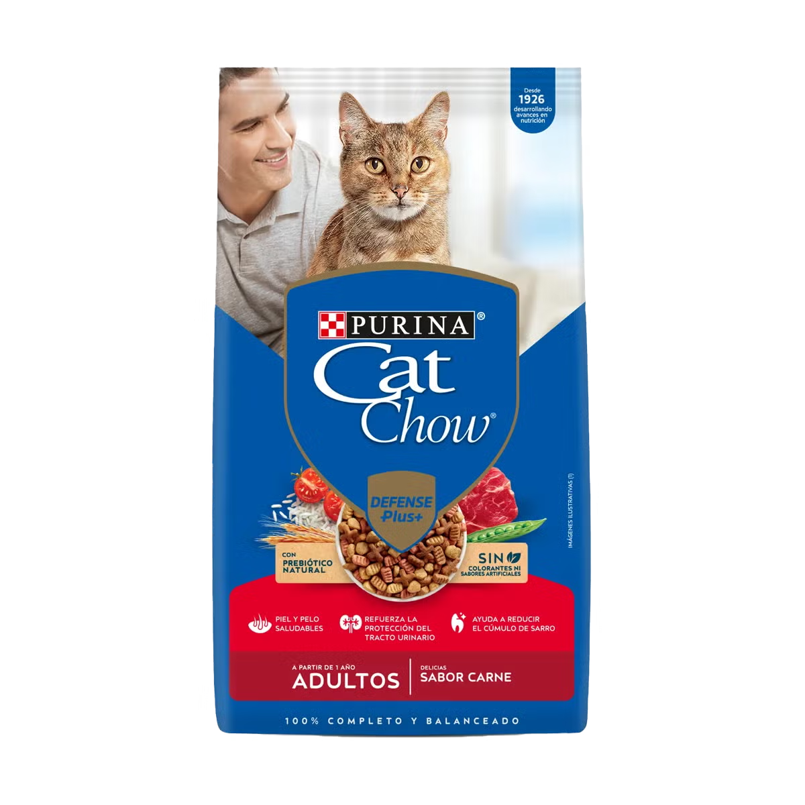
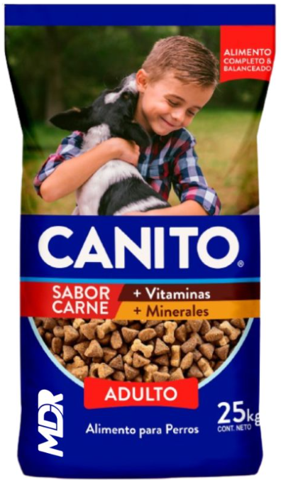
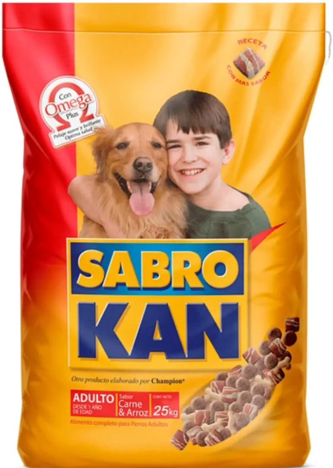

## Purina
https://purina.cl/catchow/productos/adultos-carne -> Maíz, harina de soya, harina de subproductos de pollo, harina de carne y hueso de cerdo, aceite de pollo, harina de plumas de pollo, harina de carne y hueso bovino ,hidrolizado de hígado de pollo y/o cerdo con TSPP en polvo, gluten de maíz, cloruro de sodio, ácido fosfórico, trigo, colorante natural caramelo, inulina, cloruro de colina, metionina, premezcla minerales quelados, cloruro de potasio,suplementos vitamínicos antioxidantes, vitamina E, taurina, arroz, levadura de cerveza (Saccharomyces cerevisiae), arvejas deshidratadas, vitamina C, colorante natural rojo carmín,carbonato de calcio, tomate en polvo, harina de alga (Schizochytrium sp), L-lisina.
https://purina.cl/proplan/gatos/adultos/producto -> En esta pagina al final hay dropdowns de Ingredientes y Analisis Garantizado (Prod 186)
https://purina.cl/proplan/gatos/adultos-7-mas/producto-> En esta pagina al final hay dropdowns de Ingredientes y Analisis Garantizado (Prod 187)

https://purina.cl/purina/perros/adultos/razas-pequenas  En esta pagina al final hay dropdowns de Ingredientes y Analisis Garantizado (Prod 209)

https://www.proplanvetdirect.com/canine-dry-en-gastroenteric -> Esta en ingles, Nutrituon incluye los ingredientes y Analisis Garantizado.

## Top One

https://www.top-one.cl/adulto-mediano-grande -> Hay un dropdown que dice analisis garantizado y otro ingredientes, solo esta la foto del formato  9kg pero no importa, usamos esa
https://www.top-one.cl/adultos-mini-peq -> Hay un dropdown que dice analisis garantizado y otro ingredientes
https://www.top-one.cl/cachorros ->  Hay un dropdown que dice analisis garantizado y otro ingredientes
https://www.top-one.cl/gatos-adultos ->  Hay un dropdown que dice analisis garantizado y otro ingredientes

## Odwalla
https://gepsapetfoods.com/odwalla/ -> Aqui hay un boton para cambiar entre Odwalla Adultos y Odwalla Cachorros, en la zona que dice "Perfecta digestibilidad de los ingredientes" en el dropdown perfil nutricional esta la nomina de ingredientes y Composicion Centesimal.

Cachorros -> NÓMINA DE INGREDIENTES

Harina de carne, harina de pollo, maíz, arroz, gluten de maíz, salvado de trigo, soja integral, pulpa de remolacha, aceite de pollo, leche en polvo, aceite de pescado (fuente de omega 3y 6), arveja, saborizante de carne, aceite de canola (fuente natural de DHA y omega 9), microalgas marinas –Schizochytrium powder– (fuente natural de DHA), manzana deshidratada, achicoria (fuente de inulina), cloruro de sodio, zanahoria deshidratada, espinaca deshidratada, suplemento de vitaminas (A, D3, E, K, tiamina, riboflavina, piridoxina, B12, ácido fólico, ácido pantoténico, niacina, biotina), cloruro de colina, suplemento de sales minerales (sulfato de zinc, óxido cúprico, óxido manganoso, sulfato ferroso, selenito de sodio, carbonato de cobalto, iodato de calcio), colorantes: marrón, dióxido de titanio, antioxidantes: BHT, BHA.

COMPOSICIÓN CENTESIMAL

Proteína bruta (mínimo)	30.0 %
Extracto etéreo (mínimo)	17.0 %
Fibra bruta (máximo)	3.0 %
Calcio (mínimo y máximo)	1.3 – 2.0 %
Fósforo (mínimo y máximo)	0.8 – 1.4 %
Minerales totales (máximo)	8.0 %
Humedad (máximo)	10.0 %
CONTENIDO EN CALORÍAS

Energía Metabolizable: 4.000 kcal/kg de materia seca. Calculada de acuerdo con metodología AAFCO (Association of American Feed Control Officials) de EE.UU.

Adultos -> NÓMINA DE INGREDIENTES

Harina de carne, harina de pollo, maíz, arroz, gluten de maíz, salvado de trigo, expeller de chía (fuente de omega 3 y 6), soja integral, pulpa de remolacha, aceite de pollo, aceite de pescado (fuente de omega 3 y 6), arveja, saborizante de carne, aceite de canola (fuente natural de DHA y omega 9), achicoria (fuente de inulina), microalgas marinas –Schizochytrium powder– (fuente natural de DHA), cloruro de sodio, zanahoria deshidratada, espinaca deshidratada, manzana deshidratada, suplemento de vitaminas (A, D3, E, K, tiamina, riboflavina, piridoxina, B12, ácido fólico, ácido pantoténico, niacina, biotina), cloruro de colina, suplemento de sales minerales (sulfato de zinc, óxido cúprico, óxido manganoso, sulfato ferroso, selenito de sodio, carbonato de cobalto, iodato de calcio), colorantes: dióxido de titanio, tartrazina, antioxidantes: BHT, BHA.

COMPOSICIÓN CENTESIMAL

Proteína bruta (mínimo)	24.0 %
Extracto etéreo (mínimo)	12.0 %
Fibra bruta (máximo)	4.5 %
Calcio (mínimo y máximo)	0.8 – 2.2 %
Fósforo (mínimo y máximo)	0.6 – 1.4 %
Minerales totales (máximo)	9.0 %
Humedad (máximo)	10.0 %
CONTENIDO EN CALORÍAS

Energía Metabolizable: 3.600 kcal/kg de materia seca. Calculada de acuerdo con metodología AAFCO (Association of American Feed Control Officials) de EE.UU.

## Mastin

http://nutritec.cl/mastin.html -> Aqui hay 4 botones, adulto, Cachorro, Raza Pequena y mastin senior, todos en la misma pagina, al final hay 2 dropdowns, Analisis Garantizado e Ingredientes. Tambien esta ahi la foto, tienen los nombres http://nutritec.cl/images/saco-cachorro.png?crc=3985798371, http://nutritec.cl/images/saco-raza-pequeña.png?crc=217535539, http://nutritec.cl/images/saco-adulto.png?crc=496110749, http://nutritec.cl/images/saco-3.png?crc=273860936. En caso de que falten marcas como Bio Cat, Regal Pet, As K nino, Cool Dog, AS Kat estan todas en http://nutritec.cl/nuestras-marcas.html y hay 6 botones, una para cada una de esas marcas y todas con el mismo funcionamiento que las de mastin:
http://nutritec.cl/bio-cat.html -> Solo esta y mastin tienen foto del saco
http://nutritec.cl/regal-pet.html -> No tiene foto
http://nutritec.cl/as-knino.html -> No tiene foto
http://nutritec.cl/cool-dog.html -> No tiene foto
http://nutritec.cl/as-kat.html -> No tiene foto

## Bavaro
Aqui son todos mediante PDF y los ingredientes y constituyentes analiticos solo se pueden obtener con OCR, los pdf los guarde, estan en la misma carpeta 

## Superpet
No existe informacion, por ahora no hacemos nada con este

## N&D
https://www.farmina.com/es/eshop/alimento-para-gatos/n&d-spirulina-feline/1002-arenque,-espirulina-&-bayas-de-goji-kitten.html -> Composicion y Componentes analiticos aparecen
https://felinus.cl/nd-natural-delicious/nd-prime-jabali-y-manzana.html -> Ahi esta la foto y la informacion mas abajo.

## Compinche

https://gepsapetfoods.com/compinches/ -> Ahi hay 3 botones, Perros Sabor Carne, Cachorros Carne y leche, Gatos Sabor Pescado y mas abajo esta la foto y en el dropdown Perfil Nutricional esta la nomina de ingredientes y Composicion Centesimal
Lo mismo ocurre con https://gepsapetfoods.com/ganacan-ganacat/ que hay 6 botones (Para todas las opciones, Ganacan Cachorros, adultos, Ganacat Gatos, etc.) y al final de todo esta en el dropdown perfil nutricional.

## Cachupin
https://lamascota.cl/cachupin-adulto?variant_id=6572357 aqui mas abajo en Detalles estan los ingredientes y el Analisis Garantizado

## Sabrocat
ingredientes -> Grano de Maíz, harina de carne y hueso, trigo, harina de subproducto de pollo, afrecho de trigo conchilla molida, hidrolizado de hígado y sal. Vitaminas: A, D3, E, B1, B6, B2, K, B12, cloruro de colina, Niacina, Pantotenato de Calcio, Acido Fólico y Biotina. Minerales: Calcio, fosforo, magnesio, potasio, sodio, zinc, cobre, manganeso, hierro, yodo, selenio y cobalto. 
Análisis Garantizado:
Proteína                    Mínimo  26%
Materia Grasa          Mínimo   9%
Fibra cruda               Máximo   4%
Humedad                 Máximo  12%

## Felinnes
Ingredientes y características nutricionales
Proteínas de origen animal y vegetal: harina de ave, salmón, carne y hueso.
Granos seleccionados: trigo, arroz, gluten meal.
Suplementos funcionales: probióticos (Lactobacillus spp.), taurina, yucca schidigera.
Ácidos grasos marinos (EPA y DHA) para sistema nervioso y pelaje.
Vitaminas: A, D3, E, K3, C, complejo B, biotina, niacina.
Minerales: zinc, cobre, manganeso, yodo, selenio.
Análisis garantizado (Adultos):
Proteína cruda: mínimo 30%
Extracto etéreo: mínimo 10%
Fibra cruda: máximo 3%
Humedad: máximo 12%
Análisis garantizado (Gatitos):
Proteína cruda: mínimo 34%
Extracto etéreo: mínimo 10%
Fibra cruda: máximo 3%
Humedad: máximo 12%

## Otros
Magnifico Perros -> Proteínas de origen animal: harina de carne y hueso vacuno; proteínas de origen vegetal: soja integral, gluten de maíz; cereales: maíz, trigo, salvado de trigo, salvado de maíz; saborizantes naturales: aceite de pollo, hidrolizado de subproductos vacunos; Sal; vitaminas: A, D3, E, K, B1, B2, B3, B5, B6, B9, B12, biotina; minerales: carbonato de calcio, óxido de zinc, sulfato de cobre, óxido de manganeso, sulfato ferroso, selenito de sodio, iodato de calcio, carbonato de cobalto. Colina; aminoácidos esenciales: L-lisina, DL-metionina; antioxidantes: tocoferoles naturales, lecitina, extracto de romero.

Zimpi -> https://gepsapetfoods.com/zimpi/ -> Al final en el dropdown Perfil Nutricional esta la nomina de ingredientes y composicion centesimal

Guau Forte -> Ingredientes: Harina de trigo, Maíz grano molido, Harina de carne, Harinilla de arroz, Sub productos del maíz, Aceite de ave, Hidrolizado de hígado, Sal, Zeolitas, Premix de vitaminas y minerales (Vitaminas A, D3, E, B1, B6, B12, Pantotenato de Calcio, Niacina, Ácido Fólico, Cloruro de Colina Vegetal, Sulfato de Cobre, Óxido de Zinc, Zinc Orgánico, Selenio de Sodio, Selenio Orgánico, Yodato de Potasio), Antioxidantes.
Análisis garantizado
PROTEÍNA/ no menos de 18%
GRASA / no menos de 7%
FIBRA / no más de 7%
CALCIO / no menos de 1%
FÓSFORO / no menos de 0,8%
HUMEDAD / no más de 10%

Askat -> No encontre foto (No importa, no la usamos), pero si los ingredientes:
Ingredientes destacados: Harina de carne, harina de pollo, cereales (maíz, trigo), grasa animal estabilizada, pulpa de remolacha, minerales (zinc, hierro, calcio, fósforo), vitaminas (A, D3, E, complejo B), y antioxidantes naturales.
Análisis garantizado (aprox.): Proteína cruda: 21% Grasa cruda: 8% Fibra cruda: 5% Humedad: 12% Cenizas: 9%

Pionero -> https://www.novapet.cl/products/pionero-18kg-alimento-premium-para-perros-adultos -> En ese link esta la foto y los ingredientes, pero te los doy por aqui:
Harina de Carne de Ave y/o Cerdo, Maíz, Arroz y/o Salvado de Arroz, Harina de Maíz, Harina de Cordero, Aceite de Ave y Cerdo, Hidrolizado de Ave y Cerdo, Levadura de Cerveza, Zeolitas, Harina de Salmón, Pomasa de Tomate, Aceite de Salmón, Sal, Premix Vitamínico (A, D3, E, K3, B1, B6, B12, Ácido Fólico, Niacina, Pantotenato de Calcio), Cloruro de Colina, Premix Mineral (Mn, Cu, I, Zn, Se, Fe, Ca, Na, S), Propionato de Calcio, Extracto de Romero y Tocoferoles, Vitamina C, Vitamina E, Extracto de Yuca y Quillay.
Analisis garantizado:
Proteína     26%
Grasa          12%
Fibra             3%
Humedad  10%

Canito -> 
INGREDIENTES:
Cereales (arroz, maíz y/o trigo), afrechillo de trigo, harina de carne y hueso, poroto soya tostado, afrecho de soya, aceite de pollo, conchuela molida, hidrolizado de pollo, sal, huevo líquido, linaza, colorantes autorizados. Minerales: Calcio; fósforo; magnesio; potasio, sodio; zinc; cobre; manganeso; hierro; yodo; selenio. Vitaminas; A,D3 E, B1, B6, B2, K, B12, cloruro de colina, niacina, pantotenato de calcio, ácido fólico, biotina.
ANÁLISIS GARANTIZADO:
Proteína bruta Mínimo 20%
Fibra Bruta Máximo 4,5%
Grasa Mínima 7%
Humedad Máximo 12%

Sabrokan -> 
Ingredientes:
Cereales (arroz, maíz y/o trigo), afrechillo de trigo, harina de carne y hueso, poroto soya tostado, afrecho de soya, aceite de pollo, conchuela molida, hidrolizado de pollo, sal, huevo líquido, linaza, colorantes autorizados. Minerales: Calcio; fósforo; magnesio; potasio, sodio; zinc; cobre; manganeso; hierro; yodo; selenio. Vitaminas; A,D3 E, B1, B6, B2, K, B12, cloruro de colina, niacina, pantotenato de calcio, ácido fólico, biotina.
Análisis Garantizado:
Proteína bruta Mínimo 20% - Fibra Bruta Máximo 4,5% - Grasa Mínima 7% - Humedad Máximo 12%

Natural Meat Perro Adulto -> Ingredientes:
Trigo, harina de pollo, gluten de maíz, germen de maíz, arveja, arroz, harina de carne, aceite de pollo, pulpa de remolacha, levadura de cerveza, suero de queso en polvo, hidrolizado proteico de pollo, aceite de pescado, zeolita, huevo en polvo, plasma bovino en polvo, sal, arándano deshidratado, ananá deshidratada, papaya deshidratada, zanahoria deshidratada, pulpa de tomate desecada, yogurt entero en polvo, extracto de yucca schidígera, propionato de calcio, ácido propiónico, BHT, BHA, Vitaminas: A, B1, B2, B6, B12, ácido pantoténico, ácido fólico, biotina, metionina, cloruro de colina. Minerales: hierro, manganeso, cobre, zinc, yodo y selenio.

Josera Chicken & Sweet Potato ->
Ingredientes
proteína de ave de corral deshidratada 26,5 % (de la cual pollo 40,0 %), harina de guisante, batata deshidratado 20%, grasas de aves, pulpa de remolacha, harina de algarroba, proteína de ave de corral hidrolizada, levaduras, sustancias minerales, fibra de manzana, polvo de achicoria, carne deshidratada de mejillón verde de nueva zelanda (perna canaliculus)
Componentes analíticos
proteína	25.0 %
contenido de grasa	17.0 %
fibra cruda	3.0 %
ceniza cruda	7.4 %
calcio	1.35 %
fósforo	0.85 %
sodio	0.45 %

Bokato Lady:
Proteinas: 
Proteína Bruta: 28%
Arginina 1.56%
Histidina 0.47%
Isoleucina: 1.28%
Lisina: 1.51%
Metionina + Cist.: 0.83%
Fenilalanina:1.29%
Treonina: 1.25%
Triptofano: 0.19%
Valina: 1.28%
Energeticos:
Grasa (Extracto Etéreo): 14%
Omega 3 (Ac.Linolenico): 0.9%
Omega 6 (Ac.Linoleico): 3.67%
Omega 9 (Ac. Oleico): 3.17%
Vitaminas:
Vitamina A:13.000 U.I.
Vitamina D:1200 U.I.
Vitamina E: 132 U.I.
Vitamina K3: 1.63 mg
Riboflavina (B2): 7.17 mg
Niacina: 55.16 mg
A.Pantotenico: 24.58 mg
Vitamina B12: 0.03 mg
Colina: 982.37 mg
Tiamina (B1): 6.75 mg
Vitamina B6: 6.65 mg
Biotina: 0.45 mg
Folacina:1.20 mg
Minerales:
Calcio: 2.50%
Fosforo Total: 1.80%
Fosforo Disponible: 1.50%
Sodio: 0.16%
Cloro: 0.17%
Potasio: 0.15%
Magnesio: 0.07%
Hierro: 103.24 mg
Zinc: 21.85mg
Manganeso: 24.55 mg
Cobre: 7.35 mg
Yodo: 0.26 mg
Cobalto: 0.27 mg
Bioselenio: 0.04 mg
Selenio: 0.04 mg
Ingredientes: Proteína de ave, maíz de grano molido, arroz de grano molido, aceite de ave, salvado de arroz, Plasma sanguíneo deshidratado en spray, hidrolizado de salmón, hidrolizado en base a hígado, blend marino de Omega 3, 6 y 9 con EPA y DHA, L-carnitina, diatomita o kieselguhr earth, maqui deshidratado ( Aristotelia chilensis) como antioxidante natural, betaglucanos, MOS, FOS, fibra natural, semilla de lino, Yucca schidigera, Quillaja saponina , glucosamina y condroitina, Cúrcuma longa , piperina, Vitamina A,D3,E,K3,B1,B2,B6;B12, ácido fólico, biotina y niacina (B3), colina , minerales orgánicos, ácidos orgánicos, Se ++ como bioselenio. Alimento completo y balanceado según requerimientos basados en las tablas de N.R.C, AAFCO de Norteamérica .