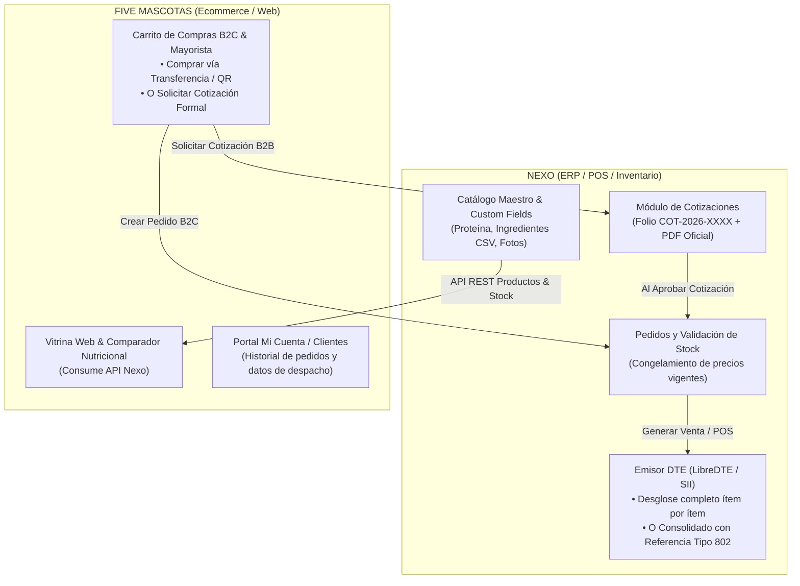

# 📋 Plan de Arquitectura e Integración: Nexo + FIVE Mascotas
> **Módulo de Cotizaciones Formales, Facturación Electrónica Flexible (DTE 33) y PIM Centralizado con Atributos Nutricionales**

---

## 📌 1. Visión General del Negocio y Objetivos

Este plan formaliza la unión estratégica entre **FIVE Mascotas** (plataforma ecommerce / PIM / catálogo nutricional) y **Nexo** (ERP / POS / Bodegas / Emisión DTE multitenant).

El diseño resuelve dos necesidades críticas de operación para FIVE Mascotas, manteniendo al mismo tiempo una arquitectura **transversal y configurable** para cualquier otra empresa registrada en Nexo:
1. **Respaldo Legal y Trazabilidad de Cotizaciones:** Las cotizaciones dejan de perderse y adquieren validez formal mediante un folio correlativo (`COT-2026-XXXX`), archivo digital en base de datos, PDF oficial con código QR y respeto estricto de precios y descuentos durante su vigencia comercial.
2. **Facturación Electrónica Flexible (Protección de Precios):** Al emitir una Factura Electrónica (DTE 33), el vendedor puede elegir entre facturar el desglose completo ítem por ítem o emitir una línea consolidada (*"Servicios o insumos según cotización adjunta"*) con doble trazabilidad tributaria ante el SII (etiqueta `<Referencia>` Código 802 con Folio y Fecha).
3. **PIM Centralizado con Atributos Dinámicos (`custom_fields`):** Nexo se convierte en la Fuente Única de Verdad (Single Source of Truth) para productos, stock y precios. Gracias al modelo de campos personalizados, FIVE Mascotas almacena sus atributos nutricionales (proteína, ingredientes en formato CSV, etapa de vida, fotos de packshots reales) y la web los consume directamente vía API.

---

## 🏛️ 2. Diagrama de Flujo y Arquitectura



---

## ⚖️ 3. Reglas Técnicas y Legales Acordadas (Fase de Diseño)

### A. Facturación Electrónica Flexible (DTE 33)
- **Configuración por Empresa:** Cada empresa define su política predeterminada (Desglosada vs Cotización Adjunta con Folio).
- **Control en Mostrador / POS:** Al momento de facturar, el vendedor puede alternar entre las dos modalidades según el acuerdo comercial con el cliente.
- **Doble Trazabilidad Legal SII:**
  - En el XML del DTE 33 se inyecta la referencia formal:
    ```xml
    <Referencia>
      <NroLinRef>1</NroLinRef>
      <TpoDocRef>802</TpoDocRef>
      <FolioRef>COT-2026-0042</FolioRef>
      <FchRef>2026-09-29</FchRef>
      <CodRef>1</CodRef>
      <RazonRef>Detalle en cotización adjunta N° COT-2026-0042</RazonRef>
    </Referencia>
    ```
  - En el detalle impreso/gráfico de la factura se incluye la glosa descriptiva para el receptor.

### B. Ciclo de Vida y Reserva de Inventario
- **Cero Compromiso Prematuro de Stock:** La cotización no congela stock físico en bodega mientras se encuentre en estado `DRAFT` o `SENT`.
- **Precios Congelados:** Los precios unitarios y descuentos pactados se respetan estrictamente durante el plazo de validez de la oferta (ej: 7 días corridos).
- **Validación al Convertir:** Al momento de que el cliente aprueba la cotización y pasa a `Order` / `Sale`, el sistema verifica la disponibilidad en la bodega correspondiente (`Location`). Si falta inventario, alerta al vendedor para ajustar cantidades o generar entrega parcial.

### C. PDF Oficial con Validez Comercial
- Estructura obligatoria del PDF:
  1. Membrete de la empresa emisora con RUT, dirección matriz y datos de contacto.
  2. Folio correlativo formal: `COT-YYYY-XXXX`.
  3. Fecha de emisión y Fecha fatal de vencimiento comercial.
  4. Identificación del cliente (RUT, Razón Social, Teléfono, Comuna de despacho).
  5. Tabla detallada: Código SKU, Descripción, Cantidad, Precio Unitario Neto, Descuento %, Subtotal.
  6. Resumen financiero: Subtotal Neto, IVA (19%), Total General.
  7. Datos bancarios oficiales para pago por transferencia electrónica.
  8. Código QR de verificación rápida.
  9. Glosa legal de oferta comercial amparada en el Código de Comercio chileno.

### D. PIM Centralizado con Atributos Nutricionales Dinámicos
- Utilización del modelo `CustomFieldDefinition` en Nexo para asociar metadatos a los productos de FIVE Mascotas:
  - `protein_percentage` (`NUMBER`): % de proteína cruda garantizada.
  - `ingredients` (`TEXT`): Lista de ingredientes en formato CSV.
  - `pet_type` (`TEXT`): Perro o Gato.
  - `life_stage` (`TEXT`): Cachorro, Adulto, Senior.
  - `breed_size` (`TEXT`): Pequeña, Mediana, Grande, Todas.
  - `gallery_images` (`JSON`): Array de URLs de hasta 5 imágenes oficiales.
- Libertad total: Cualquier otra empresa en Nexo puede definir sus propios atributos sin alterar el código fuente.

---

## 🛠️ 4. Fases de Ejecución Técnica

### Fase 1: Backend Nexo — Módulo de Cotizaciones & Base de Datos
1. **Modelos en Prisma (`apps/api/prisma/schema.prisma`):**
   - `Quotation`:
     - `id`: UUID.
     - `organizationId`: UUID.
     - `locationId`: UUID.
     - `partnerId`: UUID (relación con `CommercialPartner`).
     - `userId`: UUID (ejecutivo emisor).
     - `quotationNumber`: `COT-YYYY-XXXX`.
     - `status`: `DRAFT` | `SENT` | `ACCEPTED` | `CONVERTED_TO_ORDER` | `EXPIRED` | `CANCELLED`.
     - `validUntil`: Timestamp con zona horaria.
     - `subtotalNet`: Decimal(14,4).
     - `taxAmount`: Decimal(14,4).
     - `total`: Decimal(14,4).
     - `notes`: Text.
     - `pdfUrl`: String opcional con archivo generado.
   - `QuotationItem`:
     - `quotationId`: UUID.
     - `variantId`: UUID.
     - `quantity`: Int.
     - `unitPriceNet`: Decimal(14,4).
     - `discountApplied`: Decimal(14,4).
     - `taxRate`: Decimal(6,4) (0.1900 por defecto).
     - `subtotal`: Decimal(14,4).
2. **Endpoints API REST (`apps/api/src/modules/quotations/`):**
   - `POST /api/v1/quotations`: Crear cotización y asignar correlativo automático.
   - `GET /api/v1/quotations`: Listado paginado con filtros por estado, cliente y fechas.
   - `GET /api/v1/quotations/:id/pdf`: Render y descarga de PDF oficial con membrete y QR.
   - `POST /api/v1/quotations/:id/convert-to-order`: Valida stock y transforma a Pedido para despacho o POS.

---

### Fase 2: Facturación DTE con Modo Desglosado vs Cotización Adjunta
1. **Extensión en Servicio LibreDTE / DTE Service (`apps/api/src/modules/dte/`):**
   - Incorporar bandera `invoiceDetailMode`:
     - `ITEMIZED`: Factura normal con desglose de ítems.
     - `CONSOLIDATED_QUOTATION`: Factura con ítem consolidado y bloque `<Referencia>` (código `802`).
2. **Interfaz en Nexo App (Flutter / Web POS):**
   - Switch visual en la pantalla de cobro: *"Facturar con Detalle Completo"* vs *"Facturar con Cotización Adjunta"*.

---

### Fase 3: PIM Centralizado y Endpoint de Catálogo Público
1. **Configuración de Custom Fields en Nexo:**
   - Script de inicialización de atributos para la organización FIVE Mascotas.
2. **Endpoint Seguro para Tienda Web:**
   - `GET /api/v1/public/catalog`: Retorna productos activos, variantes, stock consolidado y los `custom_fields` nutricionales.

---

### Fase 4: Integración en FIVE Mascotas (Ecommerce & Checkout)
1. **Cliente API Nexo en FIVE Mascotas (`src/scripts/nexo-client.ts`):**
   - Consulta el catálogo centralizado de Nexo y sincroniza stock en tiempo real.
2. **Modal de Checkout y Carrito:**
   - Compras normales generan pedidos directos en Nexo (`POST /api/v1/orders`).
   - Opción *"Solicitar Cotización Formal B2B"* para pedidos mayoristas o instituciones, generando automáticamente una cotización con folio oficial en Nexo.
